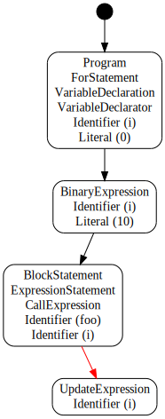
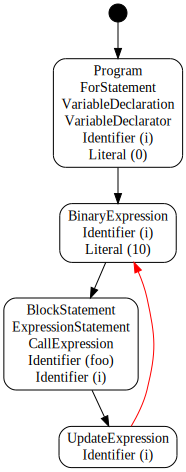
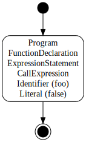

# Code Path Analysis Details

ESLint's rules can use code paths.
The code path is execution routes of programs.
It forks/joins at such as `if` statements.

```js
if (a && b) {
    foo();
}
bar();
```


## Objects

Program is expressed with several code paths.
A code path is expressed with objects of two kinds: `CodePath` and `CodePathSegment`.

### `CodePath`

`CodePath` expresses whole of one code path.
This object exists for each function and the global.
This has references of both the initial segment and the final segments of a code path.

`CodePath` has the following properties:

* `id` (`string`) - A unique string. Respective rules can use `id` to save additional information for each code path.
* `initialSegment` (`CodePathSegment`) - The initial segment of this code path.
* `finalSegments` (`CodePathSegment[]`) - The final segments which includes both returned and thrown.
* `returnedSegments` (`CodePathSegment[]`) - The final segments which includes only returned.
* `thrownSegments` (`CodePathSegment[]`) - The final segments which includes only thrown.
* `currentSegments` (`CodePathSegment[]`) - Segments of the current position.
* `upper` (`CodePath|null`) - The code path of the upper function/global scope.
* `childCodePaths` (`CodePath[]`) - Code paths of functions this code path contains.

### `CodePathSegment`

`CodePathSegment` is a part of a code path.
A code path is expressed with plural `CodePathSegment` objects, it's similar to doubly linked list.
Difference from doubly linked list is what there are forking and merging (the next/prev are plural).

`CodePathSegment` has the following properties:

* `id` (`string`) - A unique string. Respective rules can use `id` to save additional information for each segment.
* `nextSegments` (`CodePathSegment[]`) - The next segments. If forking, there are two or more. If final, there is nothing.
* `prevSegments` (`CodePathSegment[]`) - The previous segments. If merging, there are two or more. If initial, there is nothing.
* `reachable` (`boolean`) - A flag which shows whether or not it's reachable. This becomes `false` when preceded by `return`, `throw`, `break`, or `continue`.

## Events

There are five events related to code paths, and you can define event handlers in rules.

```js
module.exports = function(context) {
    return {
        /**
         * This is called at the start of analyzing a code path.
         * In this time, the code path object has only the initial segment.
         *
         * @param {CodePath} codePath - The new code path.
         * @param {ASTNode} node - The current node.
         * @returns {void}
         */
        "onCodePathStart": function(codePath, node) {
            // do something with codePath
        },

        /**
         * This is called at the end of analyzing a code path.
         * In this time, the code path object is complete.
         *
         * @param {CodePath} codePath - The completed code path.
         * @param {ASTNode} node - The current node.
         * @returns {void}
         */
        "onCodePathEnd": function(codePath, node) {
            // do something with codePath
        },

        /**
         * This is called when a code path segment was created.
         * It meant the code path is forked or merged.
         * In this time, the segment has the previous segments and has been
         * judged reachable or not.
         *
         * @param {CodePathSegment} segment - The new code path segment.
         * @param {ASTNode} node - The current node.
         * @returns {void}
         */
        "onCodePathSegmentStart": function(segment, node) {
            // do something with segment
        },

        /**
         * This is called when a code path segment was leaved.
         * In this time, the segment does not have the next segments yet.
         *
         * @param {CodePathSegment} segment - The leaved code path segment.
         * @param {ASTNode} node - The current node.
         * @returns {void}
         */
        "onCodePathSegmentEnd": function(segment, node) {
            // do something with segment
        },

        /**
         * This is called when a code path segment was looped.
         * Usually segments have each previous segments when created,
         * but when looped, a segment is added as a new previous segment into a
         * existing segment.
         *
         * @param {CodePathSegment} fromSegment - A code path segment of source.
         * @param {CodePathSegment} toSegment - A code path segment of destination.
         * @param {ASTNode} node - The current node.
         * @returns {void}
         */
        "onCodePathSegmentLoop": function(fromSegment, toSegment, node) {
            // do something with segment
        }
    };
};
```

### About `onCodePathSegmentLoop`

This event is always fired when the next segment has existed already.
That timing is the end of loops mainly.

For Example 1:

```js
while (a) {
    a = foo();
}
bar();
```

1. First, the analysis advances to the end of loop.

   

2. Second, it creates the looping path.
   At this time, the next segment has existed already, so the `onCodePathSegmentStart` event is not fired.
   It fires `onCodePathSegmentLoop` instead.

   

3. Last, it advances to the end.

   

For example 2:

```js
for (let i = 0; i < 10; ++i) {
    foo(i);
}
bar();
```

1. `for` statements are more complex.
   First, the analysis advances to `ForStatement.update`.
   The `update` segment is hovered at first.

   

2. Second, it advances to `ForStatement.body`.
   Of course the `body` segment is preceded by the `test` segment.
   It keeps the `update` segment hovering.

   

3. Third, it creates the looping path from `body` segment to `update` segment.
   At this time, the next segment has existed already, so the `onCodePathSegmentStart` event is not fired.
   It fires `onCodePathSegmentLoop` instead.

   

4. Fourth, also it creates the looping path from `update` segment to `test` segment.
   At this time, the next segment has existed already, so the `onCodePathSegmentStart` event is not fired.
   It fires `onCodePathSegmentLoop` instead.

   

5. Last, it advances to the end.

   


## Usage Examples

### To check whether or not this is reachable

```js
var last = require("lodash").last;

function isReachable(segment) {
    return segment.reachable;
}

module.exports = function(context) {
    var codePathStack = [];

    return {
        // Stores CodePath objects.
        "onCodePathStart": function(codePath) {
            codePathStack.push(codePath);
        },
        "onCodePathEnd": function(codePath) {
            codePathStack.pop();
        },

        // Checks reachable or not.
        "ExpressionStatement": function(node) {
            var codePath = last(codePathStack);

            // Checks the current code path segments.
            if (!codePath.currentSegments.some(isReachable)) {
                context.report({message: "Unreachable!", node: node});
            }
        }
    };
};
```

See Also:
[no-unreachable](https://github.com/eslint/eslint/blob/master/lib/rules/no-unreachable.js),
[no-fallthrough](https://github.com/eslint/eslint/blob/master/lib/rules/no-fallthrough.js),
[consistent-return](https://github.com/eslint/eslint/blob/master/lib/rules/consistent-return.js)

### To check state of a code path

This example is checking whether or not the parameter `cb` is called in every path.
Instances of `CodePath` and `CodePathSegment` are shared to every rule.
So a rule must not modify those instances.
Please use a map of information instead.

```js
var last = require("lodash").last;

function hasCb(node, context) {
    if (node.type.indexOf("Function") !== -1) {
        return context.getDeclaredVariables(node).some(function(v) {
            return v.type === "Parameter" && v.name === "cb";
        });
    }
    return false;
}

function isCbCalled(info) {
    return info.cbCalled;
}

module.exports = function(context) {
    var funcInfoStack = [];
    var segmentInfoMap = Object.create(null);

    return {
        // Checks `cb`.
        "onCodePathStart": function(codePath, node) {
            funcInfoStack.push({
                codePath: codePath,
                hasCb: hasCb(node, context)
            });
        },
        "onCodePathEnd": function(codePath, node) {
            funcInfoStack.pop();

            // Checks `cb` was called in every paths.
            var cbCalled = codePath.finalSegments.every(function(segment) {
                var info = segmentInfoMap[segment.id];
                return info.cbCalled;
            });

            if (!cbCalled) {
                context.report({
                    message: "`cb` should be called in every path.",
                    node: node
                });
            }
        },

        // Manages state of code paths.
        "onCodePathSegmentStart": function(segment) {
            // Ignores if `cb` doesn't exist.
            if (!last(funcInfoStack).hasCb) {
                return;
            }

            // Initialize state of this path.
            var info = segmentInfoMap[segment.id] = {
                cbCalled: false
            };

            // If there are the previous paths, merges state.
            // Checks `cb` was called in every previous path.
            if (segment.prevSegments.length > 0) {
                info.cbCalled = segment.prevSegments.every(isCbCalled);
            }
        },

        // Checks reachable or not.
        "CallExpression": function(node) {
            var funcInfo = last(funcInfoStack);

            // Ignores if `cb` doesn't exist.
            if (!funcInfo.hasCb) {
                return;
            }

            // Sets marks that `cb` was called.
            var callee = node.callee;
            if (callee.type === "Identifier" && callee.name === "cb") {
                funcInfo.codePath.currentSegments.forEach(function(segment) {
                    var info = segmentInfoMap[segment.id];
                    info.cbCalled = true;
                });
            }
        }
    };
};
```

See Also:
[constructor-super](https://github.com/eslint/eslint/blob/master/lib/rules/constructor-super.js),
[no-this-before-super](https://github.com/eslint/eslint/blob/master/lib/rules/no-this-before-super.js)

## Code Path Examples

### Hello World

```js
console.log("Hello world!");
```


### `IfStatement`

```js
if (a) {
    foo();
} else {
    bar();
}
```


### `IfStatement` (chain)

```js
if (a) {
    foo();
} else if (b) {
    bar();
} else if (c) {
    hoge();
}
```


### `SwitchStatement`

```js
switch (a) {
    case 0:
        foo();
        break;

    case 1:
    case 2:
        bar();
        // fallthrough

    case 3:
        hoge();
        break;
}
```


### `SwitchStatement` (has `default`)

```js
switch (a) {
    case 0:
        foo();
        break;

    case 1:
    case 2:
        bar();
        // fallthrough

    case 3:
        hoge();
        break;

    default:
        fuga();
        break;
}
```


### `TryStatement` (try-catch)

```js
try {
    foo();
    if (a) {
        throw new Error();
    }
    bar();
} catch (err) {
    hoge(err);
}
last();
```

It creates the paths from `try` block to `catch` block at:

* `throw` statements.
* The first throwable node (e.g. a function call) in the `try` block.
* The end of the `try` block.


### `TryStatement` (try-finally)

```js
try {
    foo();
    bar();
} finally {
    fuga();
}
last();
```

If there is not `catch` block, `finally` block has two current segments.
At this time, `CodePath.currentSegments.length` is `2`.
One is the normal path, and another is the leaving path (`throw` or `return`).


### `TryStatement` (try-catch-finally)

```js
try {
    foo();
    bar();
} catch (err) {
    hoge(err);
} finally {
    fuga();
}
last();
```


### `WhileStatement`

```js
while (a) {
    foo();
    if (b) {
        continue;
    }
    bar();
}
```


### `DoWhileStatement`

```js
do {
    foo();
    bar();
} while (a);
```


### `ForStatement`

```js
for (let i = 0; i < 10; ++i) {
    foo();
    if (b) {
        break;
    }
    bar();
}
```


### `ForStatement` (for ever)

```js
for (;;) {
    foo();
}
bar();
```


### `ForInStatement`

```js
for (let key in obj) {
    foo(key);
}
```


### When there is a function

```js
function foo(a) {
    if (a) {
        return;
    }
    bar();
}

foo(false);
```

It creates two code paths.

* The global's

  

* The function's

  
