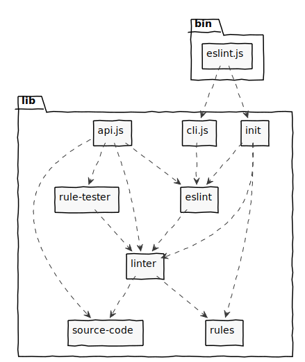

:::img-container

:::

At a high level, there are a few key parts to ESLint:

- `bin/eslint.js` - this is the file that actually gets executed with the command line utility. It's a dumb wrapper that does nothing more than bootstrap ESLint, passing the command line arguments to `cli`. This is intentionally small so as not to require heavy testing.
- `lib/api.js` - this is the entry point of `require("eslint")`. This file exposes an object that contains public classes `Linter`, `ESLint`, `RuleTester`, and `SourceCode`.
- `lib/cli.js` - this is the heart of the ESLint CLI. It takes an array of arguments and then uses `eslint` to execute the commands. The main call is `cli.execute()`. This is also the part that does all the file reading, directory traversing, input, and output.
- `lib/eslint/` - this module is the `ESLint` class that finds source code files and configuration files, then lints code with the `Linter` class. This includes the loading logic of configuration files, languages, plugins, and formatters.
- `lib/languages/js/source-code/` - this module is the `SourceCode` class that is used to represent the parsed JavaScript code. It takes in source code and the Program node of the AST representing the code.
- `lib/linter/` - this module is the core `Linter` class that does code verifying based on configuration options. This file does no file I/O and does not interact with the `console` at all. Node.js programs that need to verify source text should use this interface directly.
- `lib/rule-tester/` - this module is `RuleTester` class that is a wrapper around Mocha so that rules can be unit tested. This class lets us write consistently formatted tests for each rule that is implemented and be confident that each of the rules work. The `RuleTester` interface was modeled after Mocha and works with Mocha's global testing methods. `RuleTester` can also be modified to work with other testing frameworks.
- `lib/rules/` - this contains built-in rules that verify source code.

## The `cli` object

The `cli` object is the internal API for the command line interface. Literally, the `bin/eslint.js` file simply passes arguments to the `cli` object and then sets `process.exitCode` to the returned exit code.

The main method is `cli.execute()`, which accepts an array of strings that represent the command line options (as if `process.argv` were passed without the first two arguments).

This object's responsibilities include:

- Interpreting command line arguments.
- Reading from the file system.
- Outputting to the console.
- Outputting to the filesystem.
- Use a formatter.
- Returning the correct exit code.

This object may not call `process.exit()` directly.

## The `ESLint` class

The `ESLint` class represents the core functionality of the CLI except that it reads nothing from the command line and doesn't output anything by default. Instead, it accepts many (but not all) of the arguments that are passed into the CLI. It reads both configuration and source files as well as managing the environment that is passed into the `Linter` object.

The main method on `ESLint` instances is `lintFiles()`, which accepts an array of file paths, directory paths, and glob patterns to run the linter on.

This object's responsibilities include:

- Managing the execution environment for `Linter`.
- Reading from the file system.
- Reading configuration information from config files (usually `eslint.config.js`).
- Loading formatters.

This object may not:

- Call `process.exit()` directly.
- Output to the console.
- Use loaded formatters.

## The `Linter` object

The main method of the `Linter` object is `verify()` and accepts three arguments: the source text to verify, a configuration object, and additional options. The method first parses the given text with `espree` (or whatever parser is used by the configured language) and retrieves the AST. The AST is produced with both line/column and range locations which are useful for reporting location of issues and retrieving the source text related to an AST node, respectively.

The AST is traversed from top to bottom: at each node, the `Linter` object emits an event that has the same name as the node type (i.e., `"Identifier"`, `"WithStatement"`, etc.). On the way back up the subtree, an event is emitted with the AST type name and suffixed with `":exit"`, such as `"Identifier:exit"` - this allows rules to take action both on the way down and on the way up in the traversal. Each event is emitted with the appropriate AST node available.

This object's responsibilities include:

- Inspecting the provided source text.
- Creating an AST for the code.
- Executing rules on the AST.
- Reporting back the results of the execution.

This object may not:

- Call `process.exit()` directly.
- Perform any asynchronous operations.
- Use Node.js-specific features.
- Access the file system.
- Call `console.log()` or any other similar method.

## Rules

Individual rules are the most specialized part of the ESLint architecture. Rules can do very little, they are simply a set of instructions executed against an AST that is provided. They do get some context information passed in, but the primary responsibility of a rule is to inspect the AST and report warnings.

These objects' responsibilities are:

- Inspect the AST for specific patterns.
- Reporting warnings when certain patterns are found.

These objects may not:

- Call `process.exit()` directly.
- Perform any asynchronous operations.
- Use Node.js-specific features.
- Access the file system.
- Call `console.log()` or any other similar method.
