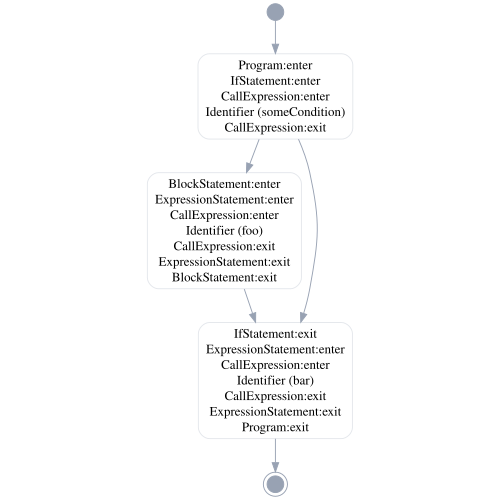
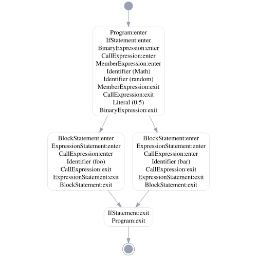
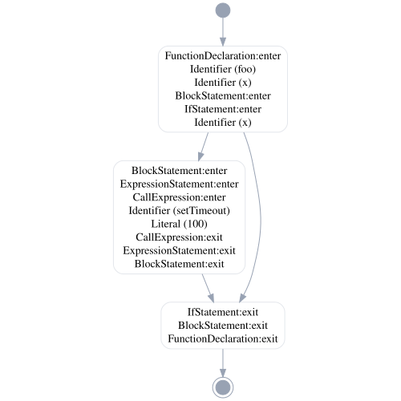
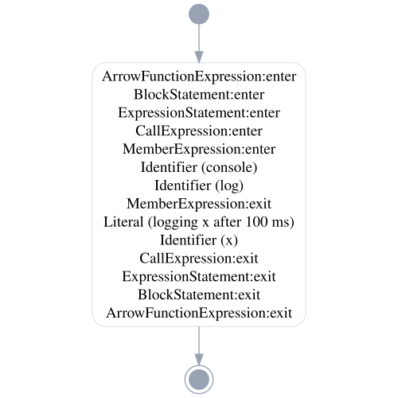
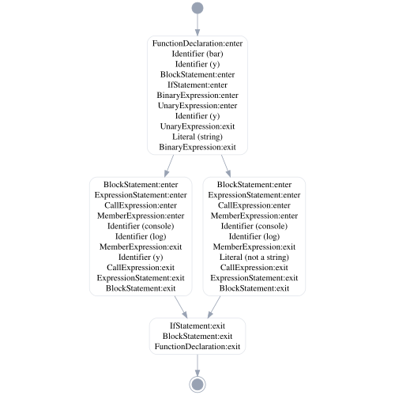
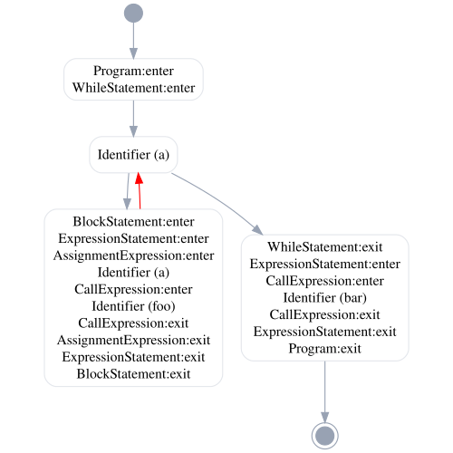
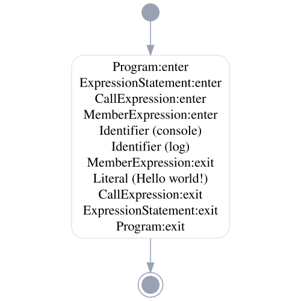
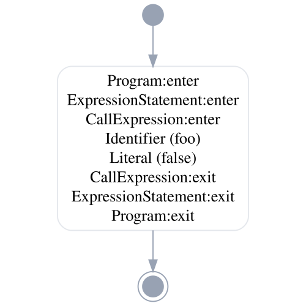
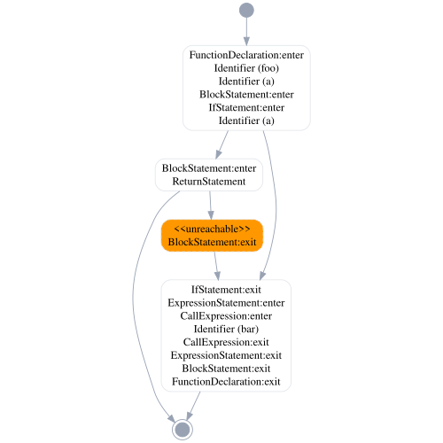

ESLint rules have access to an API to analyze code paths.
A code path represents a control flow graph that execution can take through a program.
It is composed of code path segments that fork and join at branching constructs such as `if`, `while`, `return`, `continue`, and other control flow statements.

The following is a code path diagram for a very basic program:

```js
if (someCondition()) {
	foo();
}
bar();
```

:::img-container

:::

::: tip
You can view code path diagrams for any JavaScript code using [Code Explorer](https://explorer.eslint.org).
:::

## Objects

A program/file contains multiple code paths: one for the global/top-level execution, plus one for each function, class field initializer, and class static block.
There are two fundamental objects in the code path analysis API: `CodePath` and `CodePathSegment`.

### `CodePath`

A `CodePath` object describes one control flow graph in the program. It has the following properties:

- `id` (`string`) - A string that uniquely identifies the code path. Rules can use `id` as a key to save additional information for each code path.
- `origin` (`string`) - The construct that created the code path in the program. May be `"program"`, `"function"`, `"class-field-initializer"`, or `"class-static-block"`.
- `initialSegment` (`CodePathSegment`) - The initial segment of the code path.
- `finalSegments` (`CodePathSegment[]`) - The final segments of the code path, including both returned and thrown segments.
- `returnedSegments` (`CodePathSegment[]`) - The final segments of the code path, including only returned segments.
- `thrownSegments` (`CodePathSegment[]`) - The final segments of the code path, including only thrown segments.
- `upper` (`CodePath | null`) - The code path of the containing function/class/global scope.
- `childCodePaths` (`CodePath[]`) - Code paths of functions/classes this code path contains.

`CodePath` has the following methods:

- `traverseSegments(optionsOrCallback, callback)` - Traverses all reachable segments in this code path from the initial segment to the final segments in a depth-first order. You can optionally pass an options object with `first` (`CodePathSegment`) and `last` (`CodePathSegment`) properties to limit the traversal. The callback receives a `CodePathSegment` and a controller object, and is called with `this` set to the current `CodePath`. The controller has a `skip()` method to skip the following segments in the current branch and a `break()` method to stop traversal.

### `CodePathSegment`

`CodePathSegment` is a part of a code path with no branching in it. At each branch point in the program, one `CodePathSegment` ends, and contains links to the next possible `CodePathSegment`s, forming a directed graph (which, in general, can contain cycles, for example when a `while` loop is present). `CodePathSegment`s also contain links to the possible preceding segments, in cases where branches of a program join (such as after an `if` block).

A `CodePathSegment` has the following properties:

- `id` (`string`) - A string that uniquely identifies the code path segment. Rules can use `id` as a key to save additional information for each segment.
- `nextSegments` (`CodePathSegment[]`) - The next (reachable) segments. If forking, there are two or more. If final, this is empty.
- `prevSegments` (`CodePathSegment[]`) - The previous (reachable) segments. If joining, there are two or more. If initial, this is empty.
- `allNextSegments` (`CodePathSegment[]`) - The next segments, including both reachable and unreachable segments.
- `allPrevSegments` (`CodePathSegment[]`) - The previous segments, including both reachable and unreachable segments.
- `reachable` (`boolean`) - A flag which indicates whether or not the segment is reachable. This is `false` in segments preceded by `return`, `throw`, `break`, or `continue`.

## Accessing Code Paths

To use code path analysis in a rule, you can define event handlers for code path events (detailed below) in the object exported from the `create()` method of a rule (the same object that contains the AST node visitors). These handlers are called during the same AST traversal as the node visitors, meaning rules can track which code path (or segment) a node appears in by statefully tracking the code path events. Because the AST traversal occurs in source code order, any child function/class's code path will be visited between the start and end of the traversal of the containing function/class/global code path.

```js
module.exports = {
	meta: {
		// ...
	},
	create(context) {
		return {
			/**
			 * This is called at the start of traversing a code path.
			 *
			 * @param {CodePath} codePath - The new code path.
			 * @param {ASTNode} node - The current node.
			 * @returns {void}
			 */
			onCodePathStart(codePath, node) {
				// do something with codePath
			},

			/**
			 * This is called at the end of traversing a code path.
			 *
			 * @param {CodePath} codePath - The completed code path.
			 * @param {ASTNode} node - The current node.
			 * @returns {void}
			 */
			onCodePathEnd(codePath, node) {
				// do something with codePath
			},

			/**
			 * This is called when a reachable code path segment is entered.
			 *
			 * @param {CodePathSegment} segment - The new code path segment.
			 * @param {ASTNode} node - The current node.
			 * @returns {void}
			 */
			onCodePathSegmentStart(segment, node) {
				// do something with segment
			},

			/**
			 * This is called when a reachable code path segment is exited.
			 *
			 * @param {CodePathSegment} segment - The left code path segment.
			 * @param {ASTNode} node - The current node.
			 * @returns {void}
			 */
			onCodePathSegmentEnd(segment, node) {
				// do something with segment
			},

			/**
			 * This is called when an unreachable code path segment is entered.
			 *
			 * @param {CodePathSegment} segment - The new code path segment.
			 * @param {ASTNode} node - The current node.
			 * @returns {void}
			 */
			onUnreachableCodePathSegmentStart(segment, node) {
				// do something with segment
			},

			/**
			 * This is called when an unreachable code path segment is exited.
			 *
			 * @param {CodePathSegment} segment - The left code path segment.
			 * @param {ASTNode} node - The current node.
			 * @returns {void}
			 */
			onUnreachableCodePathSegmentEnd(segment, node) {
				// do something with segment
			},

			/**
			 * This is called when control flow loops back from `fromSegment`
			 * to another segment `toSegment` that appears earlier in the source,
			 * such as at the end of a loop body looping back to the loop condition.
			 *
			 * Because `toSegment` will have already been visited, its
			 * `onCodePathSegmentStart` and `onCodePathSegmentEnd` events
			 * (or their unreachable equivalents) will have already both been
			 * called by the time this event fires.
			 *
			 * @param {CodePathSegment} fromSegment - The code path segment the loop starts from.
			 * @param {CodePathSegment} toSegment - The code path segment the loop goes to.
			 * @param {ASTNode} node - The current node.
			 * @returns {void}
			 */
			onCodePathSegmentLoop(fromSegment, toSegment, node) {
				// do something with segment
			},
		};
	},
};
```

::: important

In old versions of ESLint (before ESLint v9), the code paths and code path segments were constructed during the traversal, and therefore the code paths and segments in the event payloads were only partially initialized when the events were called.

Since ESLint v9, however, ESLint performs a full pre-pass over the AST to build complete code path information before rules ever run ([see migration guide](https://eslint.org/docs/latest/use/migrate-to-9.0.0#-code-paths-are-now-precalculated)). This means that by the time any `onCodePath*` event fires, the `CodePath` and `CodePathSegment` objects it receives already contain all of their data (e.g., `childCodePaths`, `nextSegments`, `prevSegments`) even for parts of the code that haven't been visited yet in the traversal that rules see. You don't need to wait for a later event, such as `onCodePathEnd`, to safely read these properties.

:::

::: warning

The `CodePath` and `CodePathSegment` objects are mutable and shared across all code path events and all rules, therefore, rules should take care never to modify them.

:::

### Example: Simple Program

Consider the following simple, but nontrivial program:

```js
function foo(x) {
	if (x) {
		setTimeout(() => {
			console.log("logging x after 100 ms", x);
		}, 100);
	}
}

function bar(y) {
	if (typeof y === "string") {
		console.log(y);
	} else {
		console.log("not a string");
	}
}

if (Math.random() < 0.5) {
	foo();
} else {
	bar();
}
```

This has 4 code paths:

1. The top-level code (`origin: "global"`):

    :::img-container
    
    :::

1. The function `foo` (`origin: "function"`):

    :::img-container
    
    :::

1. The arrow function callback defined inside `foo` (`origin: "function"`):

    :::img-container
    
    :::

1. The function `bar` (`origin: "function"`):

    :::img-container
    
    :::

Its code path events are called in the following order (indentation shows nesting between a start/end pair):

```text
onCodePathStart                  s1   (top level)
  onCodePathSegmentStart         s1_1 (before the `if`, up through its test)
    onCodePathStart              s2   (foo)
      onCodePathSegmentStart     s2_1 (before `if (x)`, up through its test)
      onCodePathSegmentEnd       s2_1
      onCodePathSegmentStart     s2_2 (`if (x)` true branch: the `setTimeout(...)` call)
        onCodePathStart          s3   (arrow function callback)
          onCodePathSegmentStart s3_1 (the whole callback body)
          onCodePathSegmentEnd   s3_1
        onCodePathEnd            s3
      onCodePathSegmentEnd       s2_2
      onCodePathSegmentStart     s2_3 (after `if (x)`; falls off the end of `foo`)
      onCodePathSegmentEnd       s2_3
    onCodePathEnd                s2
    onCodePathStart              s4   (bar)
      onCodePathSegmentStart     s4_1 (before the `if`, up through its test)
      onCodePathSegmentEnd       s4_1
      onCodePathSegmentStart     s4_2 (`if` true branch: `console.log(y)`)
      onCodePathSegmentEnd       s4_2
      onCodePathSegmentStart     s4_3 (`else` branch: `console.log("not a string")`)
      onCodePathSegmentEnd       s4_3
      onCodePathSegmentStart     s4_4 (after the `if`/`else`, where the branches join; falls off the end of `bar`)
      onCodePathSegmentEnd       s4_4
    onCodePathEnd                s4
  onCodePathSegmentEnd           s1_1
  onCodePathSegmentStart         s1_2 (top-level `if` true branch: the `foo();` call)
  onCodePathSegmentEnd           s1_2
  onCodePathSegmentStart         s1_3 (top-level `else` branch: the `bar();` call)
  onCodePathSegmentEnd           s1_3
  onCodePathSegmentStart         s1_4 (after the top-level `if`/`else`, where the branches join)
  onCodePathSegmentEnd           s1_4
onCodePathEnd                    s1
```

### About `onCodePathSegmentLoop`

This event fires whenever the traversal reaches a point where control flow loops back to a segment that was already visited earlier. It fires mainly at the end of loops.

<!-- Is there a good reason to use this event anymore? -->

Consider the code path of the following `while` loop:

```js
while (a) {
	a = foo();
}
bar();
```

:::img-container

:::

The sequence of events for this program looks like the following (indentation shows nesting between a start/end pair):

```text
onCodePathStart           (program)
  onCodePathSegmentStart  (before the loop)
  onCodePathSegmentEnd    (before the loop)
  onCodePathSegmentStart  (test: `a`)
  onCodePathSegmentEnd    (test: `a`)
  onCodePathSegmentStart  (body: `a = foo();`)
    onCodePathSegmentLoop (body -> test, highlighted above in red)
  onCodePathSegmentEnd    (body)
  onCodePathSegmentStart  (after the loop: `bar();`)
  onCodePathSegmentEnd    (after the loop)
onCodePathEnd             (program)
```

Notice that `onCodePathSegmentLoop` fires _before_ `onCodePathSegmentEnd` for the `body` segment: it represents control flow looping back to `test` from a point at the end of `body`. Because `test` was already fully visited in an earlier step, its `onCodePathSegmentStart`/`onCodePathSegmentEnd` pair doesn't fire again.

## Usage Examples

### Track current segment position

To track the current code path segment position, you can define a rule like this:

```js
export default {
	meta: {
		// ...
	},
	create(context) {
		// tracks the code path we are currently in
		let currentCodePath;

		// a Set that tracks the segments we've traversed in the current code path
		let currentSegments;

		// stack to track the current Set of segments for all open paths.
		const allCurrentSegments = [];

		return {
			onCodePathStart(codePath) {
				currentCodePath = codePath;
				allCurrentSegments.push(currentSegments);
				currentSegments = new Set();
			},

			onCodePathEnd(codePath) {
				currentCodePath = codePath.upper;
				currentSegments = allCurrentSegments.pop();
			},

			onCodePathSegmentStart(segment) {
				currentSegments.add(segment);
			},

			onCodePathSegmentEnd(segment) {
				currentSegments.delete(segment);
			},

			onUnreachableCodePathSegmentStart(segment) {
				currentSegments.add(segment);
			},

			onUnreachableCodePathSegmentEnd(segment) {
				currentSegments.delete(segment);
			},
		};
	},
};
```

In this example, the `currentCodePath` variable is used to access the code path that is currently being traversed and the `currentSegments` variable tracks the segments in that code path that have been traversed to that point. Note that `currentSegments` both starts and ends as an empty set, constantly being updated as the traversal progresses.

Tracking the current segment position is helpful for analyzing the code path that led to a particular node, as in the next example.

### Find an unreachable node

To find an unreachable node, track the current segment position and then use a node visitor to check if any of the segments are reachable. For example, the following looks for any `ExpressionStatement` that is unreachable.

```js
function areAnySegmentsReachable(segments) {
	for (const segment of segments) {
		if (segment.reachable) {
			return true;
		}
	}

	return false;
}

export default {
	meta: {
		// ...
	},
	create(context) {
		// tracks the code path we are currently in
		let currentCodePath;

		// a Set that tracks the segments we've traversed in the current code path
		let currentSegments;

		// stack to track the current Set of segments for all open paths.
		const allCurrentSegments = [];

		return {
			onCodePathStart(codePath) {
				currentCodePath = codePath;
				allCurrentSegments.push(currentSegments);
				currentSegments = new Set();
			},

			onCodePathEnd(codePath) {
				currentCodePath = codePath.upper;
				currentSegments = allCurrentSegments.pop();
			},

			onCodePathSegmentStart(segment) {
				currentSegments.add(segment);
			},

			onCodePathSegmentEnd(segment) {
				currentSegments.delete(segment);
			},

			onUnreachableCodePathSegmentStart(segment) {
				currentSegments.add(segment);
			},

			onUnreachableCodePathSegmentEnd(segment) {
				currentSegments.delete(segment);
			},

			ExpressionStatement(node) {
				// check all the code path segments that led to this node
				if (!areAnySegmentsReachable(currentSegments)) {
					context.report({ message: "Unreachable!", node });
				}
			},
		};
	},
};
```

See Also:
[no-unreachable](https://github.com/eslint/eslint/blob/HEAD/lib/rules/no-unreachable.js),
[no-fallthrough](https://github.com/eslint/eslint/blob/HEAD/lib/rules/no-fallthrough.js),
[consistent-return](https://github.com/eslint/eslint/blob/HEAD/lib/rules/consistent-return.js)

### Check if a function is called in every path

This example checks whether or not the parameter `cb` is called in every path.

```js
function hasCb(node, context) {
	if (node.type.includes("Function")) {
		const sourceCode = context.sourceCode;
		return sourceCode
			.getDeclaredVariables(node)
			.some(v => v.type === "Parameter" && v.name === "cb");
	}
	return false;
}

function isCbCalled(info) {
	return info.cbCalled;
}

export default {
	meta: {
		// ...
	},
	create(context) {
		let funcInfo;
		const funcInfoStack = [];
		const segmentInfoMap = new Map();

		return {
			// Checks `cb`.
			onCodePathStart(codePath, node) {
				funcInfoStack.push(funcInfo);

				funcInfo = {
					codePath: codePath,
					hasCb: hasCb(node, context),
					currentSegments: new Set(),
				};
			},

			onCodePathEnd(codePath, node) {
				funcInfo = funcInfoStack.pop();

				// Checks `cb` was called in every path.
				const cbCalled = codePath.finalSegments.every(
					function (segment) {
						const info = segmentInfoMap.get(segment.id);
						return info.cbCalled;
					},
				);

				if (!cbCalled) {
					context.report({
						message: "`cb` should be called in every path.",
						node: node,
					});
				}
			},

			// Manages state of code paths and tracks traversed segments
			onCodePathSegmentStart(segment) {
				funcInfo.currentSegments.add(segment);

				// Ignores if `cb` doesn't exist.
				if (!funcInfo.hasCb) {
					return;
				}

				// Initialize state of this path.
				const info = { cbCalled: false };
				segmentInfoMap.set(segment.id, info);

				// If there are previous segments, merge their state.
				// Checks `cb` was called in every previous path.
				if (segment.prevSegments.length > 0) {
					info.cbCalled = segment.prevSegments.every(isCbCalled);
				}
			},

			// Tracks unreachable segment traversal
			onUnreachableCodePathSegmentStart(segment) {
				funcInfo.currentSegments.add(segment);
			},

			// Tracks reachable segment traversal
			onCodePathSegmentEnd(segment) {
				funcInfo.currentSegments.delete(segment);
			},

			// Tracks unreachable segment traversal
			onUnreachableCodePathSegmentEnd(segment) {
				funcInfo.currentSegments.delete(segment);
			},

			// Checks whether the call is reachable.
			CallExpression(node) {
				// Ignores if `cb` doesn't exist.
				if (!funcInfo.hasCb) {
					return;
				}

				// Marks that `cb` was called.
				const callee = node.callee;
				if (callee.type === "Identifier" && callee.name === "cb") {
					funcInfo.currentSegments.forEach(segment => {
						const info = segmentInfoMap.get(segment.id);
						info.cbCalled = true;
					});
				}
			},
		};
	},
};
```

See Also:
[constructor-super](https://github.com/eslint/eslint/blob/HEAD/lib/rules/constructor-super.js),
[no-this-before-super](https://github.com/eslint/eslint/blob/HEAD/lib/rules/no-this-before-super.js)

## Limitations

ESLint's code path analysis is an approximation of the actual runtime possibilities of a JavaScript program, not an exact model.
In modern JavaScript, almost anything can technically throw, including function calls, property access, and [even referencing a declared identifier](https://developer.mozilla.org/en-US/docs/Web/JavaScript/Reference/Statements/let#temporal_dead_zone_tdz).
Code path analysis usually assumes all of these will succeed rather than modeling every possible throw point.

## Code Path Examples

### Hello World

```js
console.log("Hello world!");
```

:::img-container

:::

### `IfStatement`

```js
if (a) {
	foo();
} else {
	bar();
}
```

:::img-container

:::

### `IfStatement` (chain)

```js
if (a) {
	foo();
} else if (b) {
	bar();
} else if (c) {
	baz();
}
```

:::img-container

:::

### `LogicalExpression`

Note that `&&` and `||` are branching constructs, due to their short-circuiting behavior.

```js
const foo = a && b;
```

:::img-container

:::

### `SwitchStatement`

```js
switch (a) {
	case 0:
		foo();
		break;

	case 1:
	case 2:
		bar();
	// fallthrough

	case 3:
		baz();
		break;
}
```

:::img-container

:::

### `SwitchStatement` (has `default`)

```js
switch (a) {
	case 0:
		foo();
		break;

	case 1:
	case 2:
		bar();
	// fallthrough

	case 3:
		baz();
		break;

	default:
		quux();
		break;
}
```

:::img-container

:::

### `TryStatement` (try-catch)

```js
try {
	foo();
	if (a) {
		throw new Error();
	}
	bar();
} catch (err) {
	baz(err);
}
last();
```

Code path analysis creates paths from the `try` block to the `catch` block at:

- `throw` statements.
- The first throwable node (e.g. a function call) in the `try` block.
- The end of the `try` block.

:::img-container

:::

### `TryStatement` (try-finally)

```js
try {
	foo();
	bar();
} finally {
	baz();
}
last();
```

If there is no `catch` block, the `finally` block has two current segments: the normal path and the leaving path (from a `throw` or `return` in the `try` block).
If you ran the "Find an unreachable node" example above on this code, `currentSegments.size` would be `2` while traversing the `finally` block.

:::img-container

:::

### `TryStatement` (try-catch-finally)

```js
try {
	foo();
	bar();
} catch (err) {
	baz(err);
} finally {
	quux();
}
last();
```

:::img-container

:::

### `WhileStatement`

```js
while (a) {
	foo();
	if (b) {
		continue;
	}
	bar();
}
```

:::img-container

:::

### `DoWhileStatement`

```js
do {
	foo();
	bar();
} while (a);
```

:::img-container

:::

### `ForStatement`

```js
for (let i = 0; i < 10; ++i) {
	foo();
	if (b) {
		break;
	}
	bar();
}
```

:::img-container

:::

### `ForStatement` (infinite loop)

```js
for (;;) {
	foo();
}
bar();
```

:::img-container

:::

### `ForInStatement`

```js
for (let key in obj) {
	foo(key);
}
```

:::img-container

:::

### When there is a function

```js
function foo(a) {
	if (a) {
		return;
	}
	bar();
}

foo(false);
```

This program is composed of two code paths:

1. The global code path

:::img-container

:::

2. The function `foo()`'s code path.

:::img-container

:::

### `YieldExpression` in generator functions

```js
function* generator(flag) {
	yield 1;
	if (flag) {
		foo();
	}
	bar();
}
```

In generator functions `yield` can create three code paths:

- To the next segment.
- To the thrown path.
- To the end of the function.

:::img-container

:::
