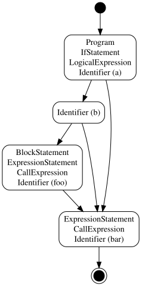
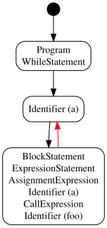
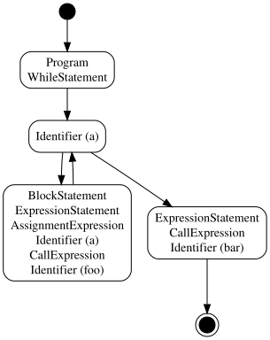
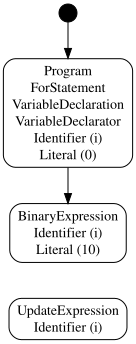
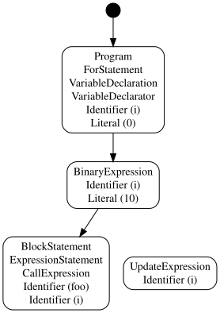
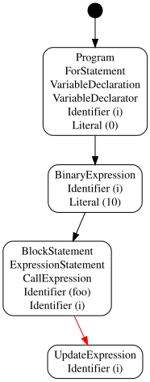
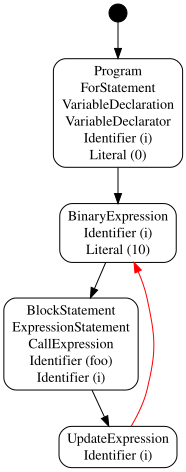
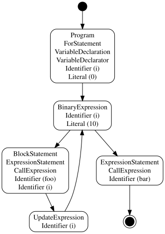

ESLint rules have access to an API to analyze code paths.
A code path represents a control flow graph that execution can take through a program.
It is comprised of code path segments that fork and join at branching constructs such as `if`, `while`, `return`, `continue`, and other control flow statements.

```js
if (a && b) {
	foo();
}
bar();
```

:::img-container

:::

::: tip
You can view code path diagrams for any JavaScript code using [Code Explorer](https://explorer.eslint.org).
:::

## Objects

A program contains multiple code paths: one for the global/top-level execution, plus one for each function, class field initializer, and class static block.
There are two fundamental objects in the code path analysis API: `CodePath` and `CodePathSegment`.

### `CodePath`

A `CodePath` object describes one control flow graph in the program. It has the following properties:

- `id` (`string`) - A unique string. Respective rules can use `id` to save additional information for each code path.
- `origin` (`string`) - The construct that created the code path in the program. May be `"program"`, `"function"`, `"class-field-initializer"`, or `"class-static-block"`.
- `initialSegment` (`CodePathSegment`) - The initial segment of the code path.
- `finalSegments` (`CodePathSegment[]`) - The final segments of the code path, including both returned and thrown segments.
- `returnedSegments` (`CodePathSegment[]`) - The final segments of the code path, including only returned segments.
- `thrownSegments` (`CodePathSegment[]`) - The final segments of the code path, including only thrown segments.
- `upper` (`CodePath|null`) - The code path of the containing function/class/global scope.
- `childCodePaths` (`CodePath[]`) - Code paths of functions/classes this code path contains.

`CodePath` has the following methods:

<!-- traverseSegments traverses once? infinite loop? DFS? BFS? -->
<!-- are all branches from `first` to `last` traversed? Or is it just one? -->

- `traverseSegments(optionsOrCallback, callback)` - Traverses all reachable segments in this code path from the initial segment to the final segments. You can optionally pass an options object with `first` (`CodePathSegment`) and `last` (`CodePathSegment`) properties to limit the traversal. The callback receives a `CodePathSegment` and a controller object, and is called with `this` set to the current `CodePath`. The controller has a `skip()` method to skip the following segments in the current branch and a `break()` method to stop traversal.

### `CodePathSegment`

`CodePathSegment` is a part of a code path with no branching in it. At each branch point in the program, one `CodePathSegment` ends, and contains links to the next possible `CodePathSegment`s, forming a directed graph (which, in general, can contain cycles, for example when a `while` loop is present). `CodePathSegment`s also contain links to the possible preceding segments, in cases where branches of a program join (such as _after_ an `if` block).

A `CodePathSegment` has the following properties:

- `id` (`string`) - A unique string. Respective rules can use `id` to save additional information for each segment.
- `nextSegments` (`CodePathSegment[]`) - The next (reachable) segments. If forking, there are two or more. If final, this is empty.
- `prevSegments` (`CodePathSegment[]`) - The previous (reachable) segments. If joining, there are two or more. If initial, this is empty.
- `allNextSegments` (`CodePathSegment[]`) - The next segments, including both reachable and unreachable segments.
- `allPrevSegments` (`CodePathSegment[]`) - The previous segments, including both reachable and unreachable segments.
- `reachable` (`boolean`) - A flag which indicates whether or not the segment is reachable. This is `false` in segments preceded by `return`, `throw`, `break`, or `continue`.

## Events

There are seven events related to code paths, and you can define event handlers for them alongside node visitors in the object exported from the `create()` method of a rule. These handlers are called during the same AST traversal as the node visitors, meaning rules can track which code path (segment) a node appears in by statefully tracking the code path events. Because the AST traversal occurs in source code order, any child function/class's code path will be visited between the start and end of the traversal of the containing function/class/global code path.

::: important
Since ESLint V9, ESLint performs a full pre-pass over the AST to build complete code path information before rules ever run. This means that by the time any `onCodePath*` event fires, the `CodePath` and `CodePathSegment` objects it receives already contain all of their data (e.g., `childCodePaths`, `nextSegments`, `prevSegments`) even for parts of the code that haven't been visited yet in the traversal that rules see. You don't need to wait for a later event, such as `onCodePathEnd`, to safely read these properties.
:::

The `CodePath` and `CodePathSegment` objects are mutable and shared across all code path events and all rules, therefore, rules should take care never to modify them.

```js
module.exports = {
	meta: {
		// ...
	},
	create(context) {
		return {
			/**
			 * This is called at the start of traversing a code path.
			 *
			 * @param {CodePath} codePath - The new code path.
			 * @param {ASTNode} node - The current node.
			 * @returns {void}
			 */
			onCodePathStart(codePath, node) {
				// do something with codePath
			},

			/**
			 * This is called at the end of traversing a code path.
			 *
			 * @param {CodePath} codePath - The completed code path.
			 * @param {ASTNode} node - The current node.
			 * @returns {void}
			 */
			onCodePathEnd(codePath, node) {
				// do something with codePath
			},

			/**
			 * This is called when a reachable code path segment is entered.
			 * It means the code path has forked or merged.
			 *
			 * @param {CodePathSegment} segment - The new code path segment.
			 * @param {ASTNode} node - The current node.
			 * @returns {void}
			 */
			onCodePathSegmentStart(segment, node) {
				// do something with segment
			},

			/**
			 * This is called when a reachable code path segment is exited.
			 *
			 * @param {CodePathSegment} segment - The left code path segment.
			 * @param {ASTNode} node - The current node.
			 * @returns {void}
			 */
			onCodePathSegmentEnd(segment, node) {
				// do something with segment
			},

			/**
			 * This is called when an unreachable code path segment is entered.
			 * It means the code path is forked or merged.
			 *
			 * @param {CodePathSegment} segment - The new code path segment.
			 * @param {ASTNode} node - The current node.
			 * @returns {void}
			 */
			onUnreachableCodePathSegmentStart(segment, node) {
				// do something with segment
			},

			/**
			 * This is called when an unreachable code path segment is exited.
			 *
			 * @param {CodePathSegment} segment - The left code path segment.
			 * @param {ASTNode} node - The current node.
			 * @returns {void}
			 */
			onUnreachableCodePathSegmentEnd(segment, node) {
				// do something with segment
			},

			/**
			 * This is called after a code path segment exits, and a subsequent code path segment appears earlier in the source code.
			 * In other words, this is called when a back edge would occur in the DFS traversal of the code path.
			 *
			 * Therefore the `onCodePathSegmentStart` and `onCodePathSegmentEnd` events for the `toSegment` will both have already been called.
			 *
			 * @param {CodePathSegment} fromSegment - A code path segment of source.
			 * @param {CodePathSegment} toSegment - A code path segment of destination.
			 * @param {ASTNode} node - The current node.
			 * @returns {void}
			 */
			onCodePathSegmentLoop(fromSegment, toSegment, node) {
				// do something with segment
			},
		};
	},
};
```

### About `onCodePathSegmentLoop`

This event is always fired when the next segment has been visited already. It fires mainly when the end of a loop is encountered.

For Example 1:

```js
while (a) {
	a = foo();
}
bar();
```

<!-- This needs to be redone. -->

1. First, the analysis advances to the end of loop.

:::img-container

:::

2. Second, it creates the looping path.
   At this time, the next segment has existed already, so the `onCodePathSegmentStart` event is not fired.
   It fires `onCodePathSegmentLoop` instead.

:::img-container

:::

3. Last, it advances to the end.

:::img-container

:::

For example 2:

```js
for (let i = 0; i < 10; ++i) {
	foo(i);
}
bar();
```

<!-- This also needs to be reworded. -->

1. `for` statements are more complex.
   First, the analysis advances to `ForStatement.update`.
   The `update` segment is hovered at first.

:::img-container

:::

2. Second, it advances to `ForStatement.body`.
   Of course the `body` segment is preceded by the `test` segment.
   It keeps the `update` segment hovering.

:::img-container

:::

3. Third, it creates the looping path from `body` segment to `update` segment.
   At this time, the next segment has existed already, so the `onCodePathSegmentStart` event is not fired.
   It fires `onCodePathSegmentLoop` instead.

:::img-container

:::

4. Fourth, also it creates the looping path from `update` segment to `test` segment.
   At this time, the next segment has existed already, so the `onCodePathSegmentStart` event is not fired.
   It fires `onCodePathSegmentLoop` instead.

:::img-container

:::

5. Last, it advances to the end.

:::img-container

:::

## Usage Examples

### Track current segment position

To track the current code path segment position, you can define a rule like this:

<!-- How can multiple segments be active at once within a given code path. Shouldn't the segment visiting order have parenthesis structure? -->

```js
module.exports = {
	meta: {
		// ...
	},
	create(context) {
		// tracks the code path we are currently in
		let currentCodePath;

		// tracks the segments we've traversed in the current code path
		let currentSegments;

		// stack to track current segments for all open paths.
		const allCurrentSegments = [];

		return {
			onCodePathStart(codePath) {
				currentCodePath = codePath;
				allCurrentSegments.push(currentSegments);
				currentSegments = new Set();
			},

			onCodePathEnd(codePath) {
				currentCodePath = codePath.upper;
				currentSegments = allCurrentSegments.pop();
			},

			onCodePathSegmentStart(segment) {
				currentSegments.add(segment);
			},

			onCodePathSegmentEnd(segment) {
				currentSegments.delete(segment);
			},

			onUnreachableCodePathSegmentStart(segment) {
				currentSegments.add(segment);
			},

			onUnreachableCodePathSegmentEnd(segment) {
				currentSegments.delete(segment);
			},
		};
	},
};
```

In this example, the `currentCodePath` variable is used to access the code path that is currently being traversed and the `currentSegments` variable tracks the segments in that code path that have been traversed to that point. Note that `currentSegments` both starts and ends as an empty set, constantly being updated as the traversal progresses.

Tracking the current segment position is helpful for analyzing the code path that led to a particular node, as in the next example.

### Find an unreachable node

To find an unreachable node, track the current segment position and then use a node visitor to check if any of the segments are reachable. For example, the following looks for any `ExpressionStatement` that is unreachable.

```js
function areAnySegmentsReachable(segments) {
	for (const segment of segments) {
		if (segment.reachable) {
			return true;
		}
	}

	return false;
}

module.exports = {
	meta: {
		// ...
	},
	create(context) {
		// tracks the code path we are currently in
		let currentCodePath;

		// tracks the segments we've traversed in the current code path
		let currentSegments;

		// stack to track all current segments for all open paths
		const allCurrentSegments = [];

		return {
			onCodePathStart(codePath) {
				currentCodePath = codePath;
				allCurrentSegments.push(currentSegments);
				currentSegments = new Set();
			},

			onCodePathEnd(codePath) {
				currentCodePath = codePath.upper;
				currentSegments = allCurrentSegments.pop();
			},

			onCodePathSegmentStart(segment) {
				currentSegments.add(segment);
			},

			onCodePathSegmentEnd(segment) {
				currentSegments.delete(segment);
			},

			onUnreachableCodePathSegmentStart(segment) {
				currentSegments.add(segment);
			},

			onUnreachableCodePathSegmentEnd(segment) {
				currentSegments.delete(segment);
			},

			ExpressionStatement(node) {
				// check all the code path segments that led to this node
				if (!areAnySegmentsReachable(currentSegments)) {
					context.report({ message: "Unreachable!", node });
				}
			},
		};
	},
};
```

See Also:
[no-unreachable](https://github.com/eslint/eslint/blob/HEAD/lib/rules/no-unreachable.js),
[no-fallthrough](https://github.com/eslint/eslint/blob/HEAD/lib/rules/no-fallthrough.js),
[consistent-return](https://github.com/eslint/eslint/blob/HEAD/lib/rules/consistent-return.js)

### Check if a function is called in every path

This example checks whether or not the parameter `cb` is called in every path.

```js
function hasCb(node, context) {
	if (node.type.indexOf("Function") !== -1) {
		const sourceCode = context.sourceCode;
		return sourceCode
			.getDeclaredVariables(node)
			.some(v => v.type === "Parameter" && v.name === "cb");
	}
	return false;
}

function isCbCalled(info) {
	return info.cbCalled;
}

module.exports = {
	meta: {
		// ...
	},
	create(context) {
		let funcInfo;
		const funcInfoStack = [];
		const segmentInfoMap = new Map();

		return {
			// Checks `cb`.
			onCodePathStart(codePath, node) {
				funcInfoStack.push(funcInfo);

				funcInfo = {
					codePath: codePath,
					hasCb: hasCb(node, context),
					currentSegments: new Set(),
				};
			},

			onCodePathEnd(codePath, node) {
				funcInfo = funcInfoStack.pop();

				// Checks `cb` was called in every paths.
				const cbCalled = codePath.finalSegments.every(
					function (segment) {
						const info = segmentInfoMap.get(segment.id);
						return info.cbCalled;
					},
				);

				if (!cbCalled) {
					context.report({
						message: "`cb` should be called in every path.",
						node: node,
					});
				}
			},

			// Manages state of code paths and tracks traversed segments
			onCodePathSegmentStart(segment) {
				funcInfo.currentSegments.add(segment);

				// Ignores if `cb` doesn't exist.
				if (!funcInfo.hasCb) {
					return;
				}

				// Initialize state of this path.
				const info = { cbCalled: false };
				segmentInfoMap.set(segment.id, info);

				// If there are the previous paths, merges state.
				// Checks `cb` was called in every previous path.
				if (segment.prevSegments.length > 0) {
					info.cbCalled = segment.prevSegments.every(isCbCalled);
				}
			},

			// Tracks unreachable segment traversal
			onUnreachableCodePathSegmentStart(segment) {
				funcInfo.currentSegments.add(segment);
			},

			// Tracks reachable segment traversal
			onCodePathSegmentEnd(segment) {
				funcInfo.currentSegments.delete(segment);
			},

			// Tracks unreachable segment traversal
			onUnreachableCodePathSegmentEnd(segment) {
				funcInfo.currentSegments.delete(segment);
			},

			// Checks reachable or not.
			CallExpression(node) {
				// Ignores if `cb` doesn't exist.
				if (!funcInfo.hasCb) {
					return;
				}

				// Sets marks that `cb` was called.
				const callee = node.callee;
				if (callee.type === "Identifier" && callee.name === "cb") {
					funcInfo.currentSegments.forEach(segment => {
						const info = segmentInfoMap.get(segment.id);
						info.cbCalled = true;
					});
				}
			},
		};
	},
};
```

See Also:
[constructor-super](https://github.com/eslint/eslint/blob/HEAD/lib/rules/constructor-super.js),
[no-this-before-super](https://github.com/eslint/eslint/blob/HEAD/lib/rules/no-this-before-super.js)

## Limitations

The code path analysis in ESLint is an approximation of the actual runtime possibilities of JS.
In modern JS, almost anything can technically throw, including function calls, property access, and [even referencing a declared identifier](https://developer.mozilla.org/en-US/docs/Web/JavaScript/Reference/Statements/let#temporal_dead_zone_tdz).
ESLint's code path analysis usually assumes all of these will succeed. Within a `try` block, however, these may be treated more pessimistically, for example, function calls are treated as potentially throwing.

## Code Path Examples

### Hello World

```js
console.log("Hello world!");
```

:::img-container

:::

### `IfStatement`

```js
if (a) {
	foo();
} else {
	bar();
}
```

:::img-container

:::

### `IfStatement` (chain)

```js
if (a) {
	foo();
} else if (b) {
	bar();
} else if (c) {
	hoge();
}
```

:::img-container

:::

### `SwitchStatement`

```js
switch (a) {
	case 0:
		foo();
		break;

	case 1:
	case 2:
		bar();
	// fallthrough

	case 3:
		hoge();
		break;
}
```

:::img-container

:::

### `SwitchStatement` (has `default`)

```js
switch (a) {
	case 0:
		foo();
		break;

	case 1:
	case 2:
		bar();
	// fallthrough

	case 3:
		hoge();
		break;

	default:
		fuga();
		break;
}
```

:::img-container

:::

### `TryStatement` (try-catch)

```js
try {
	foo();
	if (a) {
		throw new Error();
	}
	bar();
} catch (err) {
	hoge(err);
}
last();
```

It creates the paths from `try` block to `catch` block at:

- `throw` statements.
- The first throwable node (e.g. a function call) in the `try` block.
- The end of the `try` block.

:::img-container

:::

### `TryStatement` (try-finally)

```js
try {
	foo();
	bar();
} finally {
	fuga();
}
last();
```

If there is not `catch` block, `finally` block has two current segments.
At this time when running the previous example to find unreachable nodes, `currentSegments.length` is `2`.
One is the normal path, and another is the leaving path (`throw` or `return`).

:::img-container

:::

### `TryStatement` (try-catch-finally)

```js
try {
	foo();
	bar();
} catch (err) {
	hoge(err);
} finally {
	fuga();
}
last();
```

:::img-container

:::

### `WhileStatement`

```js
while (a) {
	foo();
	if (b) {
		continue;
	}
	bar();
}
```

:::img-container

:::

### `DoWhileStatement`

```js
do {
	foo();
	bar();
} while (a);
```

:::img-container

:::

### `ForStatement`

```js
for (let i = 0; i < 10; ++i) {
	foo();
	if (b) {
		break;
	}
	bar();
}
```

:::img-container

:::

### `ForStatement` (for ever)

```js
for (;;) {
	foo();
}
bar();
```

:::img-container

:::

### `ForInStatement`

```js
for (let key in obj) {
	foo(key);
}
```

:::img-container

:::

### When there is a function

```js
function foo(a) {
	if (a) {
		return;
	}
	bar();
}

foo(false);
```

This program is comprised of 2 code paths.

1. The global code path

:::img-container

:::

1. The function `foo()`'s code path.

:::img-container

:::

### `YieldExpression` in generator functions

```js
function* generator(flag) {
	yield 1;
	if (flag) {
		foo();
	}
	bar();
}
```

In generator functions `yield` can create three code paths:

- To the next segment.
- To the thrown path.
- To the end of the function.

:::img-container

:::
