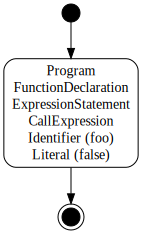

ESLint's rules can use code paths.
The code path is execution routes of programs.
It forks/joins at such as `if` statements.

```js
if (a && b) {
    foo();
}
bar();
```

:::img-container

:::

## Objects

Program is expressed with several code paths.
A code path is expressed with objects of two kinds: `CodePath` and `CodePathSegment`.

### `CodePath`

`CodePath` expresses whole of one code path.
This object exists for each function and the global.
This has references of both the initial segment and the final segments of a code path.

`CodePath` has the following properties:

* `id` (`string`) - A unique string. Respective rules can use `id` to save additional information for each code path.
* `origin` (`string`) - The reason that the code path was started. May be `"program"`, `"function"`, `"class-field-initializer"`, or `"class-static-block"`.
* `initialSegment` (`CodePathSegment`) - The initial segment of this code path.
* `finalSegments` (`CodePathSegment[]`) - The final segments which includes both returned and thrown.
* `returnedSegments` (`CodePathSegment[]`) - The final segments which includes only returned.
* `thrownSegments` (`CodePathSegment[]`) - The final segments which includes only thrown.
* `currentSegments` (`CodePathSegment[]`) - **Deprecated.** Segments of the current traversal position.
* `upper` (`CodePath|null`) - The code path of the upper function/global scope.
* `childCodePaths` (`CodePath[]`) - Code paths of functions this code path contains.

### `CodePathSegment`

`CodePathSegment` is a part of a code path.
A code path is expressed with plural `CodePathSegment` objects, it's similar to doubly linked list.
Difference from doubly linked list is what there are forking and merging (the next/prev are plural).

`CodePathSegment` has the following properties:

* `id` (`string`) - A unique string. Respective rules can use `id` to save additional information for each segment.
* `nextSegments` (`CodePathSegment[]`) - The next segments. If forking, there are two or more. If final, there is nothing.
* `prevSegments` (`CodePathSegment[]`) - The previous segments. If merging, there are two or more. If initial, there is nothing.
* `reachable` (`boolean`) - A flag which shows whether or not it's reachable. This becomes `false` when preceded by `return`, `throw`, `break`, or `continue`.

## Events

There are seven events related to code paths, and you can define event handlers by adding them alongside node visitors in the object exported from the `create()` method of your rule.

```js
module.exports = {
    meta: {
        // ...
    },
    create(context) {

        return {
            /**
             * This is called at the start of analyzing a code path.
             * In this time, the code path object has only the initial segment.
             *
             * @param {CodePath} codePath - The new code path.
             * @param {ASTNode} node - The current node.
             * @returns {void}
             */
            onCodePathStart(codePath, node) {
                // do something with codePath
            },

            /**
             * This is called at the end of analyzing a code path.
             * In this time, the code path object is complete.
             *
             * @param {CodePath} codePath - The completed code path.
             * @param {ASTNode} node - The current node.
             * @returns {void}
             */
            onCodePathEnd(codePath, node) {
                // do something with codePath
            },

            /**
             * This is called when a reachable code path segment was created.
             * It meant the code path is forked or merged.
             * In this time, the segment has the previous segments and has been
             * judged reachable or not.
             *
             * @param {CodePathSegment} segment - The new code path segment.
             * @param {ASTNode} node - The current node.
             * @returns {void}
             */
            onCodePathSegmentStart(segment, node) {
                // do something with segment
            },

            /**
             * This is called when a reachable code path segment was left.
             * In this time, the segment does not have the next segments yet.
             *
             * @param {CodePathSegment} segment - The left code path segment.
             * @param {ASTNode} node - The current node.
             * @returns {void}
             */
            onCodePathSegmentEnd(segment, node) {
                // do something with segment
            },

            /**
             * This is called when an unreachable code path segment was created.
             * It meant the code path is forked or merged.
             * In this time, the segment has the previous segments and has been
             * judged reachable or not.
             *
             * @param {CodePathSegment} segment - The new code path segment.
             * @param {ASTNode} node - The current node.
             * @returns {void}
             */
            onUnreachableCodePathSegmentStart(segment, node) {
                // do something with segment
            },

            /**
             * This is called when an unreachable code path segment was left.
             * In this time, the segment does not have the next segments yet.
             *
             * @param {CodePathSegment} segment - The left code path segment.
             * @param {ASTNode} node - The current node.
             * @returns {void}
             */
            onUnreachableCodePathSegmentEnd(segment, node) {
                // do something with segment
            },

            /**
             * This is called when a code path segment was looped.
             * Usually segments have each previous segments when created,
             * but when looped, a segment is added as a new previous segment into a
             * existing segment.
             *
             * @param {CodePathSegment} fromSegment - A code path segment of source.
             * @param {CodePathSegment} toSegment - A code path segment of destination.
             * @param {ASTNode} node - The current node.
             * @returns {void}
             */
            onCodePathSegmentLoop(fromSegment, toSegment, node) {
                // do something with segment
            }
        };

    }
}
```

### About `onCodePathSegmentLoop`

This event is always fired when the next segment has existed already.
That timing is the end of loops mainly.

For Example 1:

```js
while (a) {
    a = foo();
}
bar();
```

1. First, the analysis advances to the end of loop.

:::img-container
   
:::

2. Second, it creates the looping path.
   At this time, the next segment has existed already, so the `onCodePathSegmentStart` event is not fired.
   It fires `onCodePathSegmentLoop` instead.

:::img-container
   
:::

3. Last, it advances to the end.

:::img-container
   
:::

For example 2:

```js
for (let i = 0; i < 10; ++i) {
    foo(i);
}
bar();
```

1. `for` statements are more complex.
   First, the analysis advances to `ForStatement.update`.
   The `update` segment is hovered at first.

:::img-container
   
:::

2. Second, it advances to `ForStatement.body`.
   Of course the `body` segment is preceded by the `test` segment.
   It keeps the `update` segment hovering.

:::img-container
   
:::

3. Third, it creates the looping path from `body` segment to `update` segment.
   At this time, the next segment has existed already, so the `onCodePathSegmentStart` event is not fired.
   It fires `onCodePathSegmentLoop` instead.

:::img-container
   
:::

4. Fourth, also it creates the looping path from `update` segment to `test` segment.
   At this time, the next segment has existed already, so the `onCodePathSegmentStart` event is not fired.
   It fires `onCodePathSegmentLoop` instead.

:::img-container
   
:::

5. Last, it advances to the end.

:::img-container
   
:::

## Usage Examples

### Track current segment position

To track the current code path segment position, you can define a rule like this:

```js
module.exports = {
    meta: {
        // ...
    },
    create(context) {

        // tracks the code path we are currently in
        let currentCodePath;

        // tracks the segments we've traversed in the current code path
        let currentSegments;

        // tracks all current segments for all open paths
        const allCurrentSegments = [];

        return {

            onCodePathStart(codePath) {
                currentCodePath = codePath;
                allCurrentSegments.push(currentSegments);
                currentSegments = new Set();
            },

            onCodePathEnd(codePath) {
                currentCodePath = codePath.upper;
                currentSegments = allCurrentSegments.pop();
            },

            onCodePathSegmentStart(segment) {
                currentSegments.add(segment);
            },

            onCodePathSegmentEnd(segment) {
                currentSegments.delete(segment);
            },

            onUnreachableCodePathSegmentStart(segment) {
                currentSegments.add(segment);
            },

            onUnreachableCodePathSegmentEnd(segment) {
                currentSegments.delete(segment);
            }
        };

    }
};
```

In this example, the `currentCodePath` variable is used to access the code path that is currently being traversed and the `currentSegments` variable tracks the segments in that code path that have been traversed to that point. Note that `currentSegments` both starts and ends as an empty set, constantly being updated as the traversal progresses.

Tracking the current segment position is helpful for analyzing the code path that led to a particular node, as in the next example.

### Find an unreachable node

To find an unreachable node, track the current segment position and then use a node visitor to check if any of the segments are reachable. For example, the following looks for any `ExpressionStatement` that is unreachable.

```js
function areAnySegmentsReachable(segments) {
    for (const segment of segments) {
        if (segment.reachable) {
            return true;
        }
    }

    return false;
}

module.exports = {
    meta: {
        // ...
    },
    create(context) {

        // tracks the code path we are currently in
        let currentCodePath;

        // tracks the segments we've traversed in the current code path
        let currentSegments;

        // tracks all current segments for all open paths
        const allCurrentSegments = [];

        return {

            onCodePathStart(codePath) {
                currentCodePath = codePath;
                allCurrentSegments.push(currentSegments);
                currentSegments = new Set();
            },

            onCodePathEnd(codePath) {
                currentCodePath = codePath.upper;
                currentSegments = allCurrentSegments.pop();
            },

            onCodePathSegmentStart(segment) {
                currentSegments.add(segment);
            },

            onCodePathSegmentEnd(segment) {
                currentSegments.delete(segment);
            },

            onUnreachableCodePathSegmentStart(segment) {
                currentSegments.add(segment);
            },

            onUnreachableCodePathSegmentEnd(segment) {
                currentSegments.delete(segment);
            },

            ExpressionStatement(node) {

                // check all the code path segments that led to this node
                if (!areAnySegmentsReachable(currentSegments)) {
                    context.report({ message: "Unreachable!", node });
                }
            }

        };

    }
};
```

See Also:
[no-unreachable](https://github.com/eslint/eslint/blob/HEAD/lib/rules/no-unreachable.js),
[no-fallthrough](https://github.com/eslint/eslint/blob/HEAD/lib/rules/no-fallthrough.js),
[consistent-return](https://github.com/eslint/eslint/blob/HEAD/lib/rules/consistent-return.js)

### Check if a function is called in every path

This example checks whether or not the parameter `cb` is called in every path.
Instances of `CodePath` and `CodePathSegment` are shared to every rule.
So a rule must not modify those instances.
Please use a map of information instead.

```js
function hasCb(node, context) {
    if (node.type.indexOf("Function") !== -1) {
        const sourceCode = context.sourceCode;
        return sourceCode.getDeclaredVariables(node).some(function(v) {
            return v.type === "Parameter" && v.name === "cb";
        });
    }
    return false;
}

function isCbCalled(info) {
    return info.cbCalled;
}

module.exports = {
    meta: {
        // ...
    },
    create(context) {

        let funcInfo;
        const funcInfoStack = [];
        const segmentInfoMap = Object.create(null);

        return {
            // Checks `cb`.
            onCodePathStart(codePath, node) {
                funcInfoStack.push(funcInfo);

                funcInfo = {
                    codePath: codePath,
                    hasCb: hasCb(node, context),
                    currentSegments: new Set()
                };
            },

            onCodePathEnd(codePath, node) {
                funcInfo = funcInfoStack.pop();

                // Checks `cb` was called in every paths.
                const cbCalled = codePath.finalSegments.every(function(segment) {
                    const info = segmentInfoMap[segment.id];
                    return info.cbCalled;
                });

                if (!cbCalled) {
                    context.report({
                        message: "`cb` should be called in every path.",
                        node: node
                    });
                }
            },

            // Manages state of code paths and tracks traversed segments
            onCodePathSegmentStart(segment) {

                funcInfo.currentSegments.add(segment);

                // Ignores if `cb` doesn't exist.
                if (!funcInfo.hasCb) {
                    return;
                }

                // Initialize state of this path.
                const info = segmentInfoMap[segment.id] = {
                    cbCalled: false
                };

                // If there are the previous paths, merges state.
                // Checks `cb` was called in every previous path.
                if (segment.prevSegments.length > 0) {
                    info.cbCalled = segment.prevSegments.every(isCbCalled);
                }
            },

            // Tracks unreachable segment traversal
            onUnreachableCodePathSegmentStart(segment) {
                funcInfo.currentSegments.add(segment);
            },

            // Tracks reachable segment traversal
            onCodePathSegmentEnd(segment) {
                funcInfo.currentSegments.delete(segment);
            },

            // Tracks unreachable segment traversal
            onUnreachableCodePathSegmentEnd(segment) {
                funcInfo.currentSegments.delete(segment);
            },

            // Checks reachable or not.
            CallExpression(node) {

                // Ignores if `cb` doesn't exist.
                if (!funcInfo.hasCb) {
                    return;
                }

                // Sets marks that `cb` was called.
                const callee = node.callee;
                if (callee.type === "Identifier" && callee.name === "cb") {
                    funcInfo.currentSegments.forEach(segment => {
                        const info = segmentInfoMap[segment.id];
                        info.cbCalled = true;
                    });
                }
            }
        };
    }
};
```

See Also:
[constructor-super](https://github.com/eslint/eslint/blob/HEAD/lib/rules/constructor-super.js),
[no-this-before-super](https://github.com/eslint/eslint/blob/HEAD/lib/rules/no-this-before-super.js)

## Code Path Examples

### Hello World

```js
console.log("Hello world!");
```

:::img-container

:::

### `IfStatement`

```js
if (a) {
    foo();
} else {
    bar();
}
```

:::img-container

:::

### `IfStatement` (chain)

```js
if (a) {
    foo();
} else if (b) {
    bar();
} else if (c) {
    hoge();
}
```

:::img-container

:::

### `SwitchStatement`

```js
switch (a) {
    case 0:
        foo();
        break;

    case 1:
    case 2:
        bar();
        // fallthrough

    case 3:
        hoge();
        break;
}
```

:::img-container

:::

### `SwitchStatement` (has `default`)

```js
switch (a) {
    case 0:
        foo();
        break;

    case 1:
    case 2:
        bar();
        // fallthrough

    case 3:
        hoge();
        break;

    default:
        fuga();
        break;
}
```

:::img-container

:::

### `TryStatement` (try-catch)

```js
try {
    foo();
    if (a) {
        throw new Error();
    }
    bar();
} catch (err) {
    hoge(err);
}
last();
```

It creates the paths from `try` block to `catch` block at:

* `throw` statements.
* The first throwable node (e.g. a function call) in the `try` block.
* The end of the `try` block.

:::img-container

:::

### `TryStatement` (try-finally)

```js
try {
    foo();
    bar();
} finally {
    fuga();
}
last();
```

If there is not `catch` block, `finally` block has two current segments.
At this time, `CodePath.currentSegments.length` is `2`.
One is the normal path, and another is the leaving path (`throw` or `return`).

:::img-container

:::

### `TryStatement` (try-catch-finally)

```js
try {
    foo();
    bar();
} catch (err) {
    hoge(err);
} finally {
    fuga();
}
last();
```

:::img-container

:::

### `WhileStatement`

```js
while (a) {
    foo();
    if (b) {
        continue;
    }
    bar();
}
```

:::img-container

:::

### `DoWhileStatement`

```js
do {
    foo();
    bar();
} while (a);
```

:::img-container

:::

### `ForStatement`

```js
for (let i = 0; i < 10; ++i) {
    foo();
    if (b) {
        break;
    }
    bar();
}
```

:::img-container

:::

### `ForStatement` (for ever)

```js
for (;;) {
    foo();
}
bar();
```

:::img-container

:::

### `ForInStatement`

```js
for (let key in obj) {
    foo(key);
}
```

:::img-container

:::

### When there is a function

```js
function foo(a) {
    if (a) {
        return;
    }
    bar();
}

foo(false);
```

It creates two code paths.

* The global's

:::img-container
  
:::

* The function's

:::img-container
  
:::
