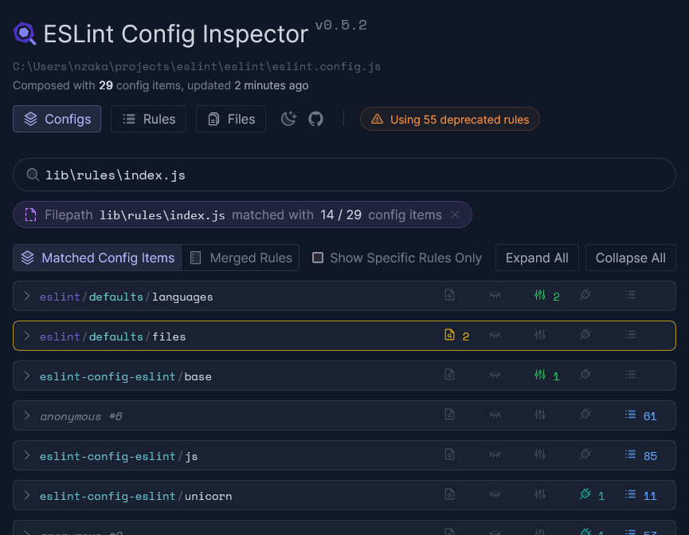

ESLint creates a configuration for each file that is linted based on your configuration file and command line options. The larger the configuration file, the more difficult it can be to determine why a file isn't linted as expected. To aid in debugging your configuration, ESLint provides several tools.

## Run the CLI in Debug Mode

**Use When:** You aren't sure if the correct configuration file is being read. This may happen if you have multiple configuration files in the same project.

**What To Do:** Run ESLint with the `--debug` command line flag and pass the file to check, like this:

```shell
npx eslint --debug file.js
```

This outputs all of ESLint's debugging information onto the console. You should copy this output to a file and then search for "eslint.config.js` to see which file is loaded. Here's some example output:

```text
eslint:eslint Using file patterns: bin/eslint.js +0ms
eslint:eslint Searching for eslint.config.js +0ms
eslint:eslint Loading config from C:\Users\nzakas\projects\eslint\eslint\eslint.config.js +5ms
eslint:eslint Config file URL is file:///C:/Users/nzakas/projects/eslint/eslint/eslint.config.js +0ms
```

## Print a File's Calculated Configuration

**Use When:** You aren't sure why linting isn't producing the expected results, either because it seems like your rule configuration isn't being honored or the wrong language options are being used.

**What To Do:** Run ESLint with the `--print-config` command line flag and pass the file to check, like this:

```shell
npx eslint --print-config file.js
```

This outputs a JSON representation of the file's calculated config, such as:

```json
{
    "linterOptions": {
        "reportUnusedDisableDirectives": 1
    },
    "language": "@/js",
    "languageOptions": {
        "sourceType": "module",
        "ecmaVersion": "latest"
    },
    "plugins": [
        "@"
    ],
    "rules": {
        "prefer-const": 2
    }
}
```

::: tip
You won't see any entries for `files`, `ignores`, or `name`, because those are only used in calculating the final configuration and so do not appear in the result. You will see any default configuration applied by ESLint itself.
:::

## Use the Config Inspector

**Use When:** You aren't sure if certain configuration objects in your configuration file match a given filename.

**What To Do:** Run ESLint with the `--inspect-config` command line flag and pass the file to check, like this:

```shell
npx eslint --inspect-config
```

This initiates the config inspector by installing and starting [`@eslint/config-inspector`](https://github.com/eslint/config-inspector). You can then type in the filename in question to see which configuration objects will apply.



The config inspector also shows you when rules are deprecated, how many available rules you're using, and more.
